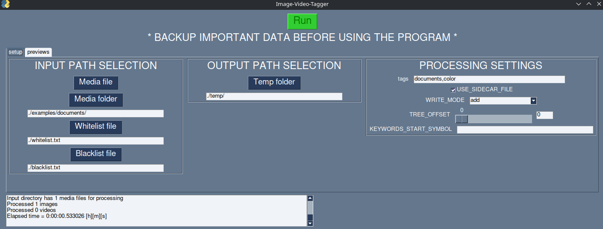
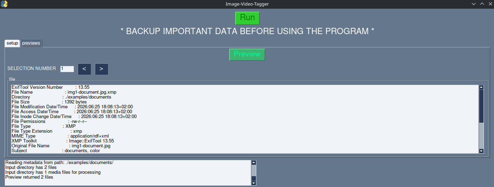

# About:  
Metadata tagging program used for images and videos. It can either add tags to metadata based on file/folder name or add/remove/overwrite user specified subjects.  

## Main features of this program:  
- image/video subject metadata tagging based on filename or manual input  
- writing to original file or separate sidecar file  
- launcher for popular ExifTool  
- supported input file types are: .jpg, .png, .mp4, .xmp  

# Installation:  
## Windows only steps - setup WSL first, then [continue](#Installation-inside-venv) with the installation inside venv
1. If WSL is not installed then install it according to [instructions](https://learn.microsoft.com/en-us/windows/wsl/install) and reboot computer.  
2. Launch WSL.  
3. Update Ubuntu system inside WSL and install required tools  
```console
sudo apt update && sudo apt upgrade -y && sudo apt install git exiftool python3-venv python-is-python3 python3-tk -y
```
4. [optionally] run command to open file explorer inside WSL directory.  
```console
explorer.exe .
```  

## Ubuntu only steps - setup system first, then [continue](#Installation-inside-venv) with the installation inside venv
Update Ubuntu system and install python tools and required tools  
```console  
sudo apt update && sudo apt upgrade -y && sudo apt install git exiftool python3-venv python-is-python3 python3-tk -y
```  

## Installation inside venv
Use those commands to download program from github and install dependencies in virtual environment:  
1. clone program repository and go to main folder  
```console
git clone https://github.com/Krzysztof-Bogunia/name2exiftag.git && cd name2exiftag
```
2. create venv in current directory  
```console
python -m venv .venv
```
3. activate venv (choose depending on platform, by default "a")  
    a. **Linux (default bash shell)**    
    ```console
    source .venv/bin/activate
    ```  
    b. Linux (fish shell)   
    ```console
    source .venv/bin/activate.fish
    ```
4. install the rest of dependencies  
```console
pip install -r requirements.txt
```  

DONE
* after everything is installed only step 3 can be required in cli program usage to activate the environment and run the program  

# Program usage: 
## Default options:  
usage: name2exiftag.py [-h] [--input INPUT] [--temp TEMP] [--tags TAGS] [--sidecar] [--mode MODE]
                       [--start START] [--folder_offset FOLDER_OFFSET] [--whitelist WHITELIST]
                       [--blacklist BLACKLIST]

Metadata editor. Program can read and add image/video subject tags.

options:
  -h, --help            show this help message and exit  
  --input INPUT         input media path. Default value: ./input/  
  --temp TEMP           output temporary media path (*CAN BE AUTOMATICALLY DELETED!*). Default value:
                        ./temp/  
  --tags TAGS           set any number of comma (,) separated xmp subject tags. Example 'tag1,tag2, name'.
                        Default value is empty  
  --sidecar             whether to use separate (sidecar) files for writing metadata. Default value is 0
                        (false)  
  --mode MODE           mode for writing subject's metadata (overwrite,add,remove). Default value is add  
  --start START         used for auto-tagging to process only text after ['start']. Default value is empty  
  --folder_offset FOLDER_OFFSET
                        used for auto-tagging to determine if parent folder's name should be used instead
                        of file name. Positive number indicate number of levels in file hierarchy. Default
                        value is 0  
  --whitelist WHITELIST
                        input whitelist file path with allowed subject tags (formatted 1 per line in .txt
                        file). Default value: ./whitelist.txt  
  --blacklist BLACKLIST
                        input blacklist file path with disallowed subject tags (formatted 1 per line in
                        .txt file). Default value: ./blacklist.txt  

## Examples:
The following examples assume that user is in main program directory.  
### Graphical interface  
Start program by double clicking on **run_gui.sh** or open console and run the following command  
```console
./run_gui.sh
```
Example image tagging using GUI  
  
  

### CLI  
If venv is not currently activated then activate it as shown in installation step 3 [instructions](#Installation-inside-venv).  

1. Add manual subjects tags (documents,color) to image and write metadata to sidecar instead of original image:  
```console
python name2exiftag.py --input ./examples/documents/img1-document.jpg --sidecar --mode add --tags 'documents,color'
```
2. Add tag equal to FOLDERNAME for all images/videos inside that folder:  
```console
python name2exiftag.py --input ./examples/focus-stacked --mode add --folder_offset 1
```
3. Add tags based on FILENAME for all images/videos inside a folder. Use only text after '-' symbol for subject tagging and write metadata to sidecar file instead of original image.  
```console
python name2exiftag.py --input ./examples/focus-stacked --mode add --folder_offset 0 --whitelist ./whitelist.txt --blacklist ./blacklist.txt --temp ./temp --start '-'
```

# License:  
Scripts and assets in this project are licensed under the MIT license.  
Third-party components installed separately may have different licenses. ExifTool is not part of this repository and needs to be provided by the user or automatically downloaded.  
